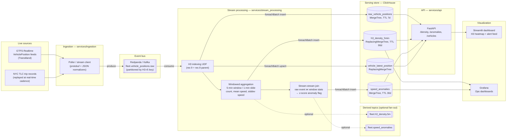

# Architecture & Tech Stack Plan

Companion to [PRD.md](./PRD.md). This document covers system design, the canonical event schema,
and the reasoning behind each technology choice.

## 1. System overview



## 2. Tech stack plan and rationale

| Layer | Choice | Why this over the alternative |
|---|---|---|
| **Event bus** | Redpanda (Kafka API-compatible) | Kafka-protocol compatible so the code ports 1:1 to Kafka, but single-binary and far lighter for a laptop/portfolio deployment — no ZooKeeper/JVM tuning |
| **Stream processing** | PySpark Structured Streaming (primary), PyFlink (secondary reference impl) | Spark Structured Streaming's micro-batch model + `foreachBatch` maps cleanly onto batched ClickHouse inserts, and its DataFrame API keeps the H3/windowing/join logic declarative and testable. A parallel PyFlink `DataStream` implementation is included to demonstrate the same pipeline under a true event-at-a-time engine and to make the trade-off (lower latency, more operational complexity) concrete rather than theoretical |
| **Spatial indexing** | Uber H3, resolution 9 (~174m edge) for density, resolution 8 parent for neighborhood roll-ups | H3's hierarchical hexagonal grid gives uniform neighbor adjacency (unlike geohash's boundary-distortion problem) and constant-time `parent`/`children` roll-ups between resolutions — exactly what "5-min density at block level, roll up to neighborhood level" needs |
| **OLAP store** | ClickHouse | Column-oriented, native H3 functions (`geoToH3`, `h3kRing`, `h3ToParent`), `ReplacingMergeTree` for versioned pre-aggregated rollups, and sub-200ms scans over hundreds of millions of rows on a single node — the throughput/latency profile this PRD targets. PostGIS is noted as an alternative where true polygon geometry (service-area boundaries, geofencing) is needed; this project's queries are cell-indexed lookups, which is ClickHouse's strength |
| **API** | FastAPI | Async, typed, thin layer translating HTTP query params into parameterized ClickHouse SQL |
| **Dashboards** | Streamlit (primary), Grafana (ops-style boards) | Streamlit for a purpose-built interactive H3 heatmap (via `pydeck`/`h3-py`); Grafana wired to the same ClickHouse tables for the "ops dashboard" angle, since that's the tool fleet-ops teams actually run day to day |
| **Dependency management** | Poetry, one `pyproject.toml` per service | Each service (ingestion, stream_processing, api, dashboard) has an independently pinned, independently deployable dependency set — a Spark job's dependency footprint has no business being in the API container's image |
| **Orchestration (local)** | Docker Compose | Redpanda + ClickHouse + Grafana as one `docker compose up`; Spark/Flink jobs are submitted separately since they're the thing being demonstrated, not infra to hide |

## 3. Canonical event schema

Every source is normalized in `services/ingestion` to this JSON payload before it reaches Kafka:

```json
{
  "vehicle_id": "MTA-4021",
  "route_id": "B41",
  "trip_id": "B41-1042-weekday",
  "source": "gtfs_rt",
  "lat": 40.678,
  "lon": -73.943,
  "speed_mps": 11.2,
  "bearing_deg": 187.5,
  "event_time": "2026-09-13T14:03:21.412Z"
}
```

`event_time` is the field watermarks are computed against end to end — ingestion timestamps are
carried separately (`ingestion_time`, added at the Kafka producer) purely for pipeline-lag
observability.

## 4. H3 resolution choice

| Resolution | Avg hexagon area | Used for |
|---|---|---|
| 9 | ~0.105 km² (~block-level) | Primary density + anomaly-join grouping key — fine enough that a dispatcher's "this block is congested" question resolves directly |
| 8 | ~0.737 km² (~neighborhood-level) | Stored as the parent of every r9 cell (`h3.cell_to_parent`) so neighborhood roll-ups are a `GROUP BY h3_r8` away, never a re-index of raw GPS |

Resolution is decided once, in the streaming layer, at write time — not at query time — because
re-deriving H3 cells from lat/lon at query time defeats the point of indexing: every query would
pay the indexing cost that streaming was supposed to absorb.

## 5. Windowing & anomaly detection design

- **Window:** 5-minute width, 1-minute slide, watermark 2 minutes (bounds state size; tolerates
  ~2 minutes of source/network jitter before an event is dropped as too late).
- **Density:** `approx_count_distinct(vehicle_id)` per `(window, h3_r9)` — approximate distinct
  count is deliberate: exact distinct over an unbounded stream requires unbounded state, and
  dispatch-facing density doesn't need single-vehicle precision.
- **Speed anomaly:** a vehicle's z-score is computed against the mean/stddev of *its own H3 cell's
  current window*, not a global or fixed threshold — a truck idling at 2 m/s in a school zone and
  a highway on-ramp cell both have legitimate, very different "normal" speeds. This is implemented
  as a stream-stream interval join (raw event stream ⋈ windowed-stats stream, joined on
  `h3_r9` with an `event_time` inside `[window.start, window.end)` condition) rather than a simple
  aggregation, because the anomaly signal is per-event, not per-window.
- **Threshold:** `|z| ≥ 3` with a minimum sample size of 5 vehicles in the window — below that, a
  single fast/slow vehicle would swing the mean enough to flag itself, which is a statistically
  meaningless alert.

## 6. ClickHouse data model summary

See [`infra/clickhouse/init/01_schema.sql`](../infra/clickhouse/init/01_schema.sql) for full DDL.
Table design at a glance:

| Table | Engine | `ORDER BY` | Purpose |
|---|---|---|---|
| `raw_vehicle_positions` | `MergeTree` | `(h3_r8, h3_r9, event_time)` | Raw event store; spatial-then-time ordering means a viewport+time query reads one contiguous range instead of scanning |
| `h3_density_5min` | `ReplacingMergeTree(ingested_at)` | `(h3_r9, window_start)` | Pre-aggregated rollup fed by Spark `foreachBatch`; each trigger re-emits the full window state, so the latest write per key wins on merge. Independently reconcilable against `raw_vehicle_positions` via `h3_density_5min_validation` |
| `speed_anomalies` | `MergeTree` | `(h3_r9, alert_time)` | Alert feed; partitioned by day, short TTL |
| `vehicle_latest_position` | `ReplacingMergeTree(event_time)` | `vehicle_id` | O(1)-ish "where is vehicle X now" lookups without scanning history |

Native ClickHouse H3 functions (`h3kRing`, `h3ToParent`, `h3GetResolution`) are used at query time
in the API layer for "cells within N rings of viewport center" expansion — H3 is computed once at
write time by Spark/Flink, and again at query time only for ring/neighbor expansion, which is
inherently a query-time operation.

## 7. What a v2 would add

- Wire `speed_anomalies` inserts to a Kafka topic consumed by a notification service
  (Slack/PagerDuty) — the table is the contract; the notifier is a thin consumer.
- Exactly-once semantics end to end (currently at-least-once with idempotent ClickHouse upserts on
  `vehicle_latest_position`; the append-only tables tolerate rare duplicates given the analytical,
  not transactional, use case).
- Kubernetes manifests / Helm chart for the Spark and Flink jobs instead of local `spark-submit`.
